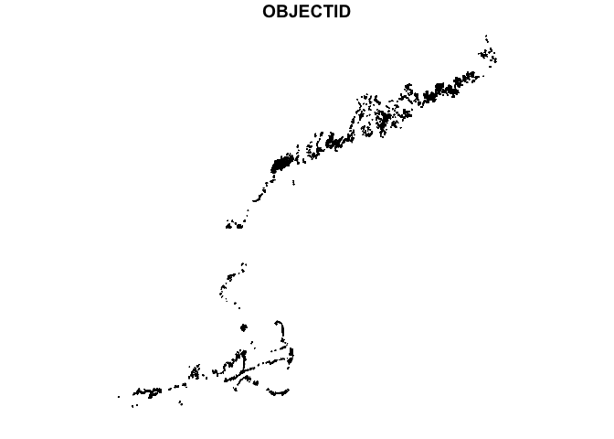

Adding web services from the Northeast Ocean Data Portal to R
================
emily shumchenia
3/5/2018

Purpose
-------

This document explains how to access data from web services on the [Northeast Ocean Data Portal](www.northeastoceandata.org) and pull it into R to conduct custom analyses. **This workflow only works with point, line, or polygon data.** I haven't figured out how to pull in raster data yet!

First, in R, install the [esri2sf package](https://github.com/yonghah/esri2sf). This package works with any web service, not just the services on the Northeast Ocean Data Portal.

``` r
library(devtools)
install_github("yonghah/esri2sf")
```

Finding web service URLs
------------------------

Next, get the URL of the web service. The [Northeast Ocean Data Portal](www.northeastoceandata.org) includes links to web services for most of the layers on the site. One of the quickest ways to find the URLs is via the layer info boxes in the Data Explorer. Open the layer info box and click on (or copy) the URL to the web service.


Import the data
---------------

The [esri2sf package](https://github.com/yonghah/esri2sf) imports the data as an sf object. The attribute table is essentially replicated as a data frame. Plot the data to test that it was imported correctly.

``` r
library(esri2sf)
eg.url <- "http://50.19.218.171/arcgis1/rest/services/MarineLifeAndHabitat/MapServer/30" ## the URL for the regional eelgrass layer
eg <- esri2sf(eg.url)
```

    ## Linking to GEOS 3.6.1, GDAL 2.1.3, proj.4 4.9.3

    ## 
    ## Attaching package: 'dplyr'

    ## The following objects are masked from 'package:stats':
    ## 
    ##     filter, lag

    ## The following objects are masked from 'package:base':
    ## 
    ##     intersect, setdiff, setequal, union

    ## [1] "Feature Layer"
    ## [1] "esriGeometryPolygon"

``` r
plot(eg, max.plot = 1) ## use max.plot to limit the number of attributes plotted
```


